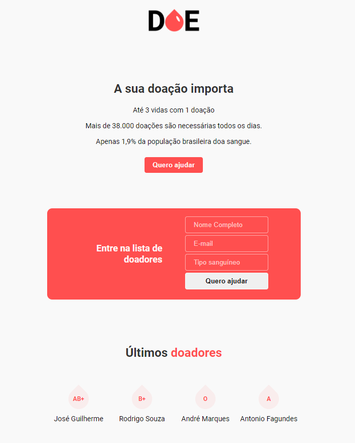

<h1 align="center">
 💧 Aplicação para cadastro de doadores de sangue
</h1>

  3ª Maratona Dev - <a href="https://rocketseat.com.br/">Rocketseat</a>

  

## ⌛ Inicialização da aplicação

Na pasta `backend`, abra um terminal e digite `yarn start`.

## 🚀 Tecnologias

### Front-end

* <a href="https://developer.mozilla.org/pt-BR/docs/Aprender/Getting_started_with_the_web/HTML_basico">HTML</a>
* <a href="https://developer.mozilla.org/pt-BR/docs/Web/CSS">CSS</a>
* <a href="https://developer.mozilla.org/pt-BR/docs/Web/JavaScript">JavaScript</a>

### Back-end

* <a href="https://nodejs.org/en/">Node</a> - Interpretador JavaScript para uso do lado do servidor
* <a href="https://expressjs.com/pt-br/">Express</a> - Framework Node que fornece um conjunto robusto de recursos para aplicativos web e móvel
* <a href="https://mozilla.github.io/nunjucks/">Nunjucks</a> - Template engine
* <a href="https://www.postgresql.org/">PostgreSQL</a> - Banco de dados

## 📝 Licensa

Este projeto está sob a licensa MIT. Veja a [licença](LICENSE) para mais informações.

---

Feito com 💟 por José Guilherme Paro Monteiro Tomaine 👋 [Fale comigo!](https://www.linkedin.com/in/jos%C3%A9-guilherme-paro-monteiro-tomaine/)
